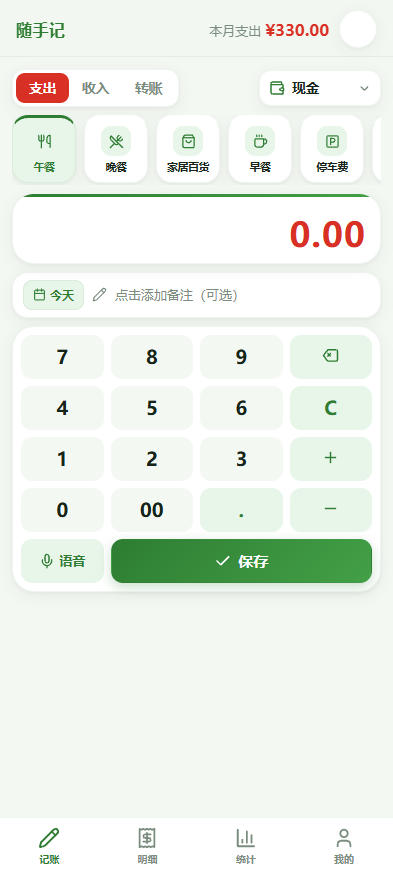
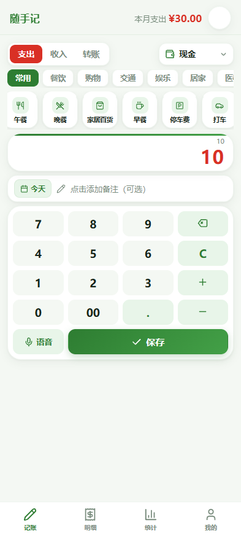
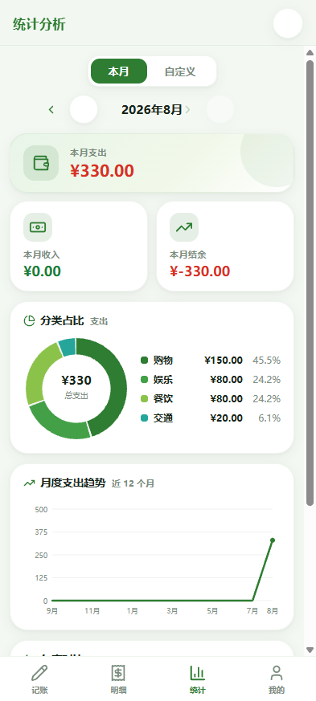
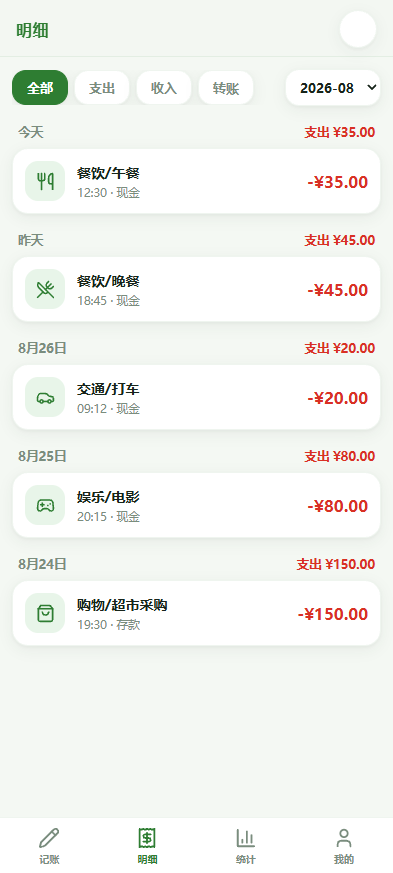
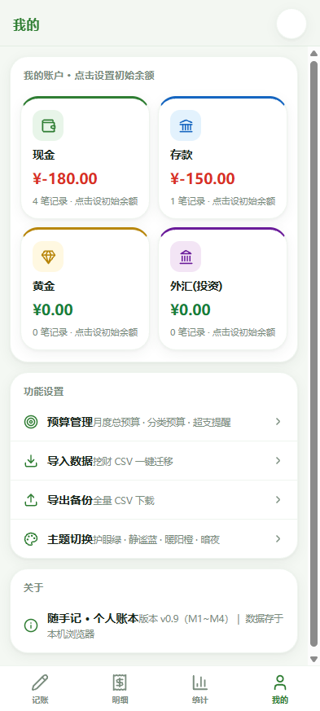

# 随手记账 · Ledger

> 一个**单文件** PWA 记账应用：零依赖、无需安装、数据完全存于本机浏览器。

> 分类区为「分类组 + 子类」两级联动，按 90 天使用频次动态生成常用 Top 10。

## ✨ 功能一览

| 模块 | 能力 |
|---|---|
| **快速记账** | 高频分类一键选 + 大数字键盘（支持 `+`/`-` 金额运算）＋ 补记日期选择 |
| **多账户** | 现金 / 存款 / 黄金 / 外汇(投资) 四账户，初始余额设置、实时余额联动 |
| **转账** | 账户间转账自动双向记账，余额实时变化 |
| **明细流水** | 按日分组时间线、类型/月份筛选、编辑与删除 |
| **统计图表** | 分类占比环形图、近 12 月趋势、年度对比、自定义时间段统计（手写 SVG，零图表库） |
| **预算管理** | 月度总预算 + 分类预算，记账即时超支预警，记账页实时进度条 |
| **数据迁移** | 挖财 CSV / Excel(.xlsx) 全量导入（UTF-8/GBK 自动识别、Excel 日期序号转换），一键导出备份 |
| **语音记账** | 说「午餐 35 块」自动识别分类与金额（支持中文数字），识别失败自动降级输入法语音面板 |
| **主题** | 5 套主题（护眼绿 / 静谧蓝 / 暖阳橙 / 暮光紫 / 暗夜），记忆选择、一键切换 |
| **PWA** | 可「添加到主屏幕」，像原生 App 一样全屏使用 |

## 📸 截图

| 记账页 | 统计页 | 明细页 | 我的页 |
|---|---|---|---|
|  |  |  |  |

## 🚀 快速开始

1. 下载 [`index.html`](index.html) 到本地
2. 双击用浏览器打开 —— 即可使用

> 无需构建、无需安装依赖、无需后端；所有数据存于浏览器 IndexedDB，离线可用。

### 部署到线上（手机使用）

任意静态托管均可（CloudStudio / GitHub Pages / Vercel 等），把 `index.html` 丢上去即可。手机浏览器打开后「添加到主屏幕」体验最佳。

## 🛠 技术栈

- 原生 HTML / CSS / JavaScript —— **零依赖、零构建**
- IndexedDB 本地存储
- 手写 SVG 图表（环形图 / 折线图）
- Web Speech API 语音识别
- SheetJS（按需加载，仅导入 .xlsx 时触发）

## 🔒 隐私说明

- 所有账本数据仅存于**你的浏览器本地**（IndexedDB），不上传任何服务器
- 不包含任何网络请求（除按需加载 xlsx 解析库）
- 关闭浏览器、清缓存不丢失；换设备不共享

## 📄 License

[MIT](LICENSE) © inevien-hub
